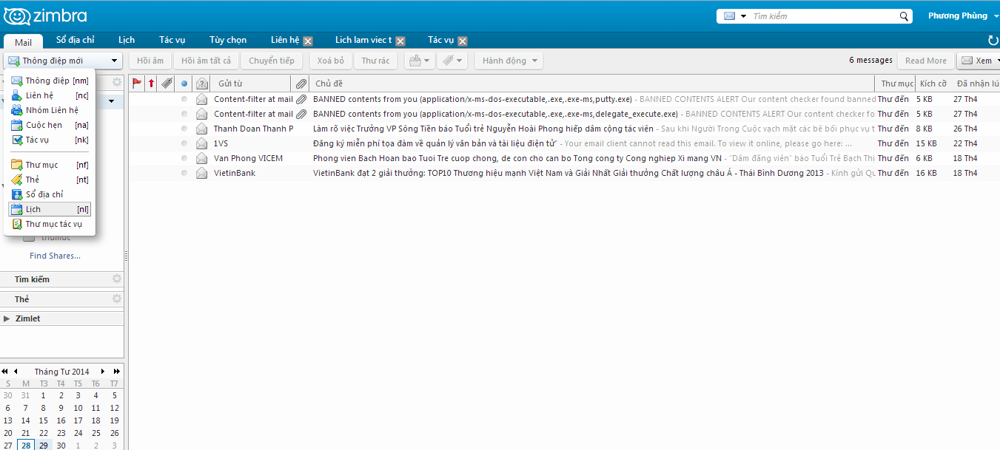

*Hướng dẫn sử dụng hệ thống webmail Zimbra*

**TÀI LIỆU HƯỚNG  DẪN SỬ DỤNG WEBMAIL ZIMBRA**

**(Dành cho máy Client)**

##

**Mục lục:**

` `***TOC \o "1-3" \h \z \u [1.***	***Truy cập vào hệ thống mail:	 PAGEREF _Toc386491951 \h 3***](#_Toc386491951)***

[**1.1.**	**Truy cập vào hệ thống:	 PAGEREF _Toc386491952 \h 3**](#_Toc386491952)

[**1.2.**	**Đổi lại mật khẩu mặc định:	 PAGEREF _Toc386491953 \h 4**](#_Toc386491953)

[**1.3.**	**Thao tác trong mail:	 PAGEREF _Toc386491955 \h 6**](#_Toc386491955)

[***2.***	***Tạo thư mới và một số thao tác liên quan	 PAGEREF _Toc386491956 \h 8***]( )

`    `***[*2.1.	Tạo thư mới	 *PAGEREF _Toc386491957 \h 8***](#_Toc386491957)***

[**2.2.**	**Một số thao tác liên quan	 PAGEREF _Toc386491958 \h 9**](#_Toc386491958)

[***3.***	***Thay đổi mật khẩu user mail và thoát khỏi hệ thống :	 PAGEREF _Toc386491999 \h 24***](#_Toc386491999)

[**3.1.**	**Thay đổi mật khẩu:	 PAGEREF _Toc386492000 \h 24**](#_Toc386492000)

[**3.2.**	**Giới thiệu thêm 1 số tác vụ trong mục tùy chọn.	 PAGEREF _Toc386492001 \h 26**]( )

[**3.3.**	**Thoát khỏi hệ thống:	 PAGEREF _Toc386492002 \h 30**](#_Toc386492002)

[**3.4.**	**Sổ địa chỉ	 PAGEREF _Toc386492003 \h 31**](#_Toc386492003)

[**3.5.**	**Giới thiệu Lịch :	 PAGEREF _Toc386492004 \h 32**](#_Toc386492004)

[**3.6.**	**Giới thiệu Tác vụ :	 PAGEREF _Toc386492005 \h 33**](#_Toc386492005)

1. **Truy cập vào hệ thống mail:**
   1. **Truy cập vào hệ thống:**
- Từ trình duyệt web NSD nhập địa chỉ : <https://mail3.quangninh.gov.vn/>
- Giao diện được hiển thị như hình bên dưới:

- Tiếp theo, NSD nhập **Tài khoản** truy cập và **Mật khẩu** tương ứng :

1. **Đổi lại mật khẩu mặc định:**

*Với những tài khoản truy cập lần đầu tiên, hệ thống sẽ yêu cầu thay đổi mật khẩu để đảm bảo an toàn thông tin.*

- Sau khi người dùng nhập Tài khoản đăng nhập, cửa số đăng nhập hiện ra yêu cầu đổi lại pass từ pass mặc định. Tiến hành nhập :
- User name 		: Nhập tên đăng nhập.
- Password   		: Nhâp password cũ.
- New password	: Nhập password mới.
- Confirm		: Nhập lại password mới.
- Phiên bản sử dụng  : Tùy chọn các phiên bản để đăng nhập vào mail tương ứng :
- Mặc định : Chuẩn này dùng cho truy cập vào mail với tốc độ truy cập internet ổn định, và hỗ trợ truy cập nhanh hơn.
- Nâng cao : Chuẩn này hỗ trợ truy cập mail nhanh hơn khi đường truyền internet bị chậm.
- Mobile : Chuẩn này hỗ trợ khi truy cập mail từ điện thoại

- Tiếp theo NSD chọn **Sign in** để thay đổi :

1. **Thao tác trong mail:**
- Sau khi đăng nhập thành công, hệ thống sẽ hiện lên trình điều khiển trong mail:

- Nếu NSD muốn chỉnh giao diện Tiếng Việt chọn mục **Preferences**, tiếp theo NSD chọn mục **Language** chọn **– Tiếng Việt.**

- Nếu NSD muốn xem thư được gửi đến NSD chọn mục **Thư đến** ( bên Menu trái ) 

- Nếu NSD muốn xem thư đã được gửi đi, NSD chọn mục **Thư đã gửi** (bên Menu trái) :

- Cách làm tương tự với 3 mục **Thư nháp**, **Thư rác**và **Thùng rác** NSD có thể kích chuột vào các chữ tương ứng và xem nội dung từng phần.
1. **Tạo thư mới và một số thao tác liên quan**
   1. **Tạo thư mới**
- Ở góc trên cùng bên trái, NSD kích chuột vào **Thông điệp mới** để bắt đầu soạn thảo một thư mới:

- Giao diện soạn thảo thư mới được hiển thị như bên dưới:

- *Các thông tin soạn thảo gửi thư bao gồm :*
- *Gửi tới*: NSD nhập địa chỉ email người cần gửi thư tới có yêu cầu phản hồi thư.
- *Cc* : NSD nhập địa chỉ người cần gửi thư tới nhưng không yêu cầu phản hồi thư.
- *Chủ đề:*NSD nhập nội dung chủ đề thư cần gửi.
- *Khung trắng rộng*: NSD nhập nội dung thư cần gửi.
- *Đính kèm*: NSD đính kèm file theo thư.
- Cách chỉnh thư theo văn bản : NSD vào Tùy chọn, sau đó chọn Định dạng theo HTML.
- Cuối cùng sau khi đã hoàn tất NSD chọn**GỬI** ở góc trên màn hình để gửi thư .

Nếu **Gửi** thành công hệ thống sẽ hiện lên thông báo : ***Đã gửi thông điệp.***

1. **Một số thao tác liên quan**
- ***Trong trường hợp người sử dụng muốn lưu thư vừa viết ra:***

- ***Trường hợp hủy và quay lại màn hình chính NSD chọn nút hủy bỏ để hủy thư :***

- Bảng yêu cầu xác thực hiện lên, NSD có thể chọn lưu lại thư hoặc không lưu để trở về màn hình chính *:*

- ***Chức năng khi ấn chuột phải vào từng thư:***
- ` `*NSD tiến hành tích chuột phải vào từng thư để tiến hành các tác vụ :*

- Cụ thể tác dụng của từng mục :
- *Đánh dấu là chưa đọc* :  NSD đánh dấu thư thành chưa đọc.
- *Hồi âm*: NSD chọn mục này nếu muốn gửi thư phản hồi cho những người trong danh sách gửi thư phản hồi.
- *Hồi âm tất cả*	: NSD chọn mục này nếu muốn gửi thư cho tất cả thành phần liên quan.
- *Chuyển tiếp* : NSD nếu muốn lấy nội dung thư này để chỉnh sửa và gửi cho địa chỉ email khác.
- *Xoá bỏ* : NSD nếu muốn loại bỏ thư khỏi danh sách.

- ***Tiện ích mục XEM ở góc trên bên phải*:** 
- NSD kích chuột vào chữ **xem** và chọn các **tác vụ** tương ứng :

***Chi tiết :***

- *Theo cuộc đàm luận* : Sắp xếp thư theo thứ tự các thư có cùng chủ đề, ta có thể tích vào các dấu tam giác ở bên trái thư để xổ xuống : 

- *Xem thư theo thông điệp* : Sắp xếp thư theo thời gian, thư càng trên cao là càng mới nhất :

- *Vùng đọc ở dưới* : Hiển thị danh sách thư ở trên, nội dung đọc thư ở dưới :

- *Vùng đọc bên phải* : Danh sách thư ở bên trái, vùng đọc thư ở bên phải :

- *Khung đọc tắt* : Chỉ hiển thị danh sách thư, đến khi tích vào thư thì khung đọc sẽ bung ra kín màn hình :

- ***Giới thiệu chức năng của nút tam giác thông điệp mới***
- *Thông điệp mới* : Nếu NSD muốn soạn 1 mail mới (Chức năng này đã được  hướng dẫn ở trên).

- *Liên hệ* : NSD tạo thông tin liên hệ của 1 cá nhân.

- NSD nhập thông tin người cần liên hệ, tiếp đó NSD chọn **Lưu lại** để lưu hoặc **Hủy bỏ** để bỏ qua :

- NSD vào **Sổ địa chỉ** để xem danh sách người liên hệ :

- *Nhóm liên hệ :* Nếu NSD muốn liên hệ với 1 nhóm .

- NSD tiến hành thêm địa chỉ nhóm từ phải qua trái :

- Sau đó NSD chọn **Lưu lại** để lưu lại hoặc **Hủy bỏ** để bỏ qua.
- *Cuộc hẹn* : NSD lên lịch làm việc để gửi cho các user email khác.

- NSD nhập thông tin cuộc hẹn và điền địa chỉ email :

- NSD chọn **Lưu lại**, tiếp theo NSD chọn **Gửi**.

- *Thư mục* : Được tạo ra để người dùng gộp những thư liên quan vào 1 nơi để NSD dễ quản lý. 

- NSD nhập tên thư mục cần tạo, chỉ định thư mục được lưu trong **Thư đi**, hoặc **Thư đến** :

**Kết quả  :**

- NSD muốn gộp thư vào thư mục chỉ cần dùng chuột kéo thư vào thư mục vừa tạo là OK.
- *Lịch* : NSD tạo 1 lịch mới để làm việc.

- NSD nhập tên lịch và thông tin vào bảng và chọn **Đồng ý**:

- NSD muốn xem danh sách lịch NSD chọn Lịch ở thanh Menu trên cùng :

- ***Hướng dẫn thực hiện tìm kiếm thư* :** 
- NSD có thể tìm kiếm thư theo địa chỉ mail cũng như từ khóa có trong thư, NSD đánh từ khóa vào ô TÌM KIẾM ở khung trắng trên bên trái màn hình rồi tích vào biểu tượng kính lúp để tìm kiếm thư :

- Kết quả thư tìm kiếm sẽ được hiển thị hết bên dưới :

1. **Thay đổi mật khẩu user mail và thoát khỏi hệ thống :**
   1. **Thay đổi mật khẩu:**
- Trên giao diện, NSD chọn **Tùy chọn** và chọn **Thay đổi mật khẩu**

***Bảng thay đổi hiện lên tiến hành nhập :***

- *Old Password*	:  NSD nhập Password cũ.
- *New Password*	: NSD nhập Password mới.
- *Confirm*		: NSD nhập lại Password mới.

- Nếu thành công kết quả sẽ là :

1. **Giới thiệu thêm 1 số tác vụ trong mục tùy chọn.**
- ***Tùy chọn đăng nhập*** :

- *Chủ đề* : Dùng để hiển thị giao diện mail :	

- *Ngôn ngữ* : Dùng hiển thị ngôn ngữ dùng trong mail, mặc định là tiếng việt:

- *Compose direction* : Hiển thị cách viết thư, có 2 cách là từ trái sang phải hoặc từ phải sang trái. Mặc định thông thường là từ trái qua phải (Left to right) :

- *Font* : Hiển thị kiểu chữ trong mail .

- *Múi giờ mặc định* : Xác định giờ trong mail, thông thường là Bangkok – HaNoi – Jakarta :

- *Tìm kiếm* :Chọn các tác vụ và ngôn ngữ tìm kiếm.

- *Khác* : 1 số tùy chọn tiện ích của mail.

1. **Thoát khỏi hệ thống:**
- Góc phải màn hình, NSD chọn biểu tượng tam giác bên cạnh tên tài khoản. Sau đó, NSD chọn **Đăng xuất** để thoát khỏi hệ thống.

- Kết quả màn hình sẽ được hiển thị như bên dưới :

1. **Sổ địa chỉ** 
- ` `Hiển thị ra danh sách cá nhân hoặc group liên hệ :

1. **Giới thiệu Lịch :**
- *Mục đích*: Hiển thị lịch làm việc cá nhân của mail ,cột bên trái là danh sách lịch đã được tạo.

- NSD muốn thêm công việc vào lịch chỉ cần tích đúp vào ô có ngày ở cột đứng và thời gian ở cột ngang tương ứng, sau đó điền thông tin vào lịch :

- NSD chọn **Đồng ý** để hoàn thành.
  1. **Giới thiệu Tác vụ :** 
- Dùng để tạo ra lịch làm việc và nhắc nhở hàng ngày, là hình thức báo thức công việc hàng ngày. NSD kích chuột vào góc trái trên màn hình chọn **Tác vụ mới** :

` `PAGE   \\* MERGEFORMAT 1

