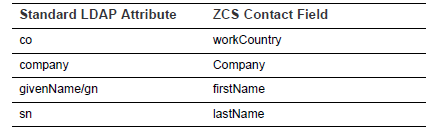
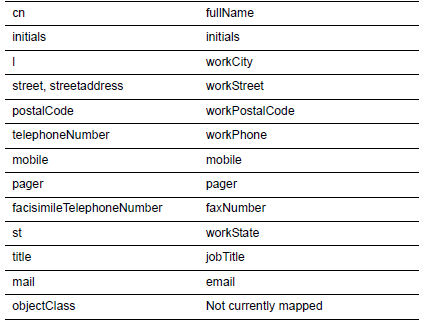
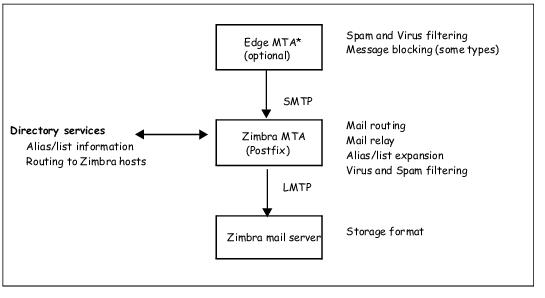
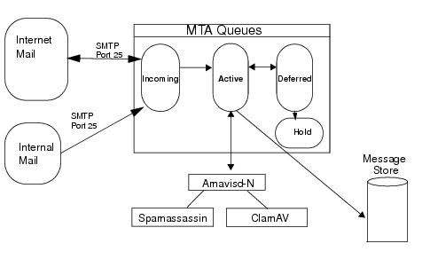

LDAP ( Lightweight Directory Access Protocol)

- Dịch vụ này cung cấp thông tin về người dùng và thiết bị được phép sử dụng zimbra. Trung tâm lưu trữ dữ liệu LDAP của zimbra là OpenLDAP directory server.

Dịch vụ này bao gồm 

- LDAP Traffic Flow
- ZCS LDAP Schema
- Account Authentication
- ZCS Objects
- Global Address List
- Flushing LDAP Cache
- LDAP server được cài đặt khi mà ZCS được cài đặt. Mỗi server có cổng LDAP của riêng nó, cổng này bao gồm các thuộc tính và thông số. 
- Các thành phần của thuộc tính có thể được sửa đổi qua cổng console quản trị zimbra hoặc qua zmprov CLI utility.
1. **LDAP Traffic Flow**
- LDAP Directory Traffic chỉ đường đi giữa zimbra-LDAP directory server và  các server khác trong ZCS system. Zimbra MTA và ZCS mailbox server đọc và viết qua LDAP database trong thư mục server.
- Các zimbra client kết nối qua zimbra server, zimbra server lại kết nối tới LDAP.

**Hệ thống thư mục LDAP (dạng cây):** 2 nhánh

- Mail branches (nhánh mail) : được sắp đặt theo tên miền ( tài khoản, nhóm, bí danh).
- Config branch(nhánh cài đặt): gồm các hệ thống admin( tài khoản, cài đặt, hỗ trợ, COS, servers, các loại MIME, zimlets)
1. **Giản đồ ZCS LDAP**
- ` `Ở lõi của mỗi sự khai triển LDAP là 1 database sử dụng giản đồ
- Phần mềm OpenLDAP được thiết  kế để kết hợp với thư mục cài đặt hiện có.
- Tất cả các thuộc tính và các lớp đối tượng đặc biệt được tạo ra cho ZCS đều được đặt trước bởi ‘zimbra’ như  zimbraAccount hay zimbraAttachmentsBlocked.
- Các giản đồ thư mục dưới đây ở trong OpenLDAP implementation :
- ` `core.schema
- ` `cosine.schema
- ` `inetorgperson.schema
- ` `zimbra.schema
- ` `amavisd.schema
- ` `dyngroup.schema
- ` `nis.schema

***CHÚ Ý : BẠN KHÔNG THỂ CHỈNH SỬA ZIMBRA SCHEMA***

`                     `**ZCS Objects**

|Objects|Desciption|Object class|
| :- | :- | :- |
|Account|
Dùng để đăng nhập vào mailbox. Có thể là của quản trị viên hoặc người dùng. Các tài khoản có các thành phần :

Tên định dạng <user@example.domain>

ID duy nhất không thể thay đổi hay tái sử dụng

Các thuộc tính, một vài có thể sửa bởi người dùng, một số khác chỉ được cài bởi quản trị viên

Các tài khoản được liên kết với 1 tên miền, nên 1 tên miền phải được tạo trước khi tạo tài khoản
|zimbraAccount|
|Class of service (COS)|Xác định tính chất mặc định của tài khoản có hoặc những đặc điểm được cho phép hoặc cấm.|ZimbraCOS|
|Domains|Tên miền của 1 email như zimbra.com. Nó phải tồn tại trước khi địa chỉ email tới người dùng trong tên miền được chuyển đi|zimbraDomain|
|Distribution Lists|Danh sách mail, dùng để gửi mail tới các thành viên trong danh sách bằng gửi tới 1 single email tới danh sách địa chỉ|zimbraDistributionList|
|Dynamic Groups|
Giống như distribution lists. Nhưng khá ở chỗ 1 dynamic group được tính toán động bởi 1 LDAP search. Bộ lọc tìm kiếm LDAP được định nghĩa trong 1 tính chất trong dynamic group entry

Chú ý: cả 2 object này được sử dụng như grantee hay mục tiêu trong delegated admistrator framework
|zimbraGroup|
|Servers|
Có 1 hoặc nhiều gói phần mềm zimbra được cài đặt.

Các thuộc tính miêu tả thông tin cấu hình máy chủ, như là dịch vụ nào đang chạy trên máy chủ
|zimbraServer|
|Global Configuration|
Giá trị mặc định cho máy chủ và tên miền khi không được cài đặt các object khác.

Các giá trị này ở trong cái gói core của zimbra.
|
zimbraGlobalConfig

|
|Alias|Bí danh của 1 account, distribution list hoặc dynamic group.|zimbraAlias|
|Zimlet|Được cài đặt và cấu hình trong zimbra|zimbraZimletEntry|
|Calendar Resource|1 tài khoản với những thuộc tính bổ xung |zimbraCalendarResource|
|Identify|Nhận dạng người dùng với tên và link.|Zimbraidentify|
|Data Source|1 nguồn thư bên ngoài của 1 người dùng ví dụ là POP3 và IMAP. 1 data source gồm POP3/IMAP server name, port, mật khẩu người dùng bên ngoài.|zimbraDataSource|
|Signature|Chữ kí người dùng. 1 user có thể tạo nhiều chữ kí.|zimbraSignature|
1. **Account Authentication (Xác thực tài khoản)**
- Các cơ chế xác thực được hỗ trợ là Internal, External LDAP, và External Active Directory. Các phương phát xác thực được cài trên mỗi miền cơ sở. Nếu k nó sẽ sử dụng mặc định
- Phương thức xác thực bên trong sử dụng giản đồ zimbra chạy trên OpenLDAP server.
- zimbraAuthFallbackToLocal attribute có thể được cho phép để hệ thống có thể trở lại xác thực cục bộ nếu xác thực bên ngoài bị lỗi. 

Cơ chế xác thực bên ngoài: phương pháp này sử dụng zimbra schema chạy trên OpenLDAP directory server. Các tài khoản được lưu trong OpenLDAP server, người dùng được cung cấp password, được tính toán trong SSHA(salt-SHA1) digest và sau đó được so sánh với giá trị được lưu

Cơ chế xác thực LDAP và AD(Active Directory) bên ngoài: được sử dụng nếu mỗi trường email sử dụng 1 máy chủ LDAP khác hoặc Microsoft Active Directory cho xác thực và zimbra-LDAP cho tất cả các ZCS có liên quan. Điều này đòi hỏi người dùng phải có cả OpenLDAP và máy chủ LDAP bên ngoài.

Phương pháp xác thực bên ngoài liên kết với các máy chủ LDAP sử dụng tên người dùng và mật khẩu được cung cấp. Nếu sự liên kêt này thành công thì mật khẩu sẽ có hiệu lực.

Cơ chế xác thực Kerberos5: một giao thức mật mã dùng để xác thực trong các mạng máy tính hoạt động trên những đường truyền không an toàn

1. **Global Address List**
- Là 1 nhóm thư muc của người dùng. ZCS sử dụng nó để tìm địa chỉ người dùng.
- Cho mỗi miền ZCS, bạn có thể cấu hình GAL để sử dụng:
- External LDAP server
- ZCS internal LDAP server
- Cả external LDAP server và OpenLDAP trong GAL searches
- ZCS web client có thể tìm kiếm GAL
- Tính chất GAL trong ZCS
- Các thuộc tính được ánh xạ tới ZCS contact theo bảng sau

- Tham số tìm kiếm ZCS GAL

GAL được cấu hình trên mỗi tên miền cơ sở. Để cấu hình các thuộc tính, bạn có thể chạy GAL Configuration Wizard từ administration console

- Chỉnh sửa thuộc tính

Thêm vào, thay đổi và xóa bỏ thuộc tính GAL thông qua zimbra administration console hoặc từ zimprov CLI ultility

Người dùng có thể chỉnh thuộc tính cho tài khoản ở trong thư mục khi mà họ thay đổi các lựa chọn từ zimbra web client.

1. **Xóa bộ nhớ cache LDAP**

Khi bạn chỉnh các mục dưới đây ở Zimbra LDAP server, bạn cần xóa LDAP cache để tạo sự thay đổi có sẵn trên máy chủ

- Themes
- Locales
- Account
- Group
- COS
- Domains
- Global configuration
- Server
- Zimlet configuration

Xóa Cache cho themes và locales: bạn cần xóa cache để tạo chỗ trống cho những nội dung mới

Xóa accounts, Groups, COS, Domains và Servers: Khi chỉnh sửa những mục trên, nó hiệu quả ngay lập tức.

Cài đặt mặc định để ZCS cập nhật máy chủ là 15 phút.

**MTA – Zimbra**

**- MTA** - Viết tắt cho Mail Transfer Agent ( điểm chuyển đổi ).

\- Nhận thư qua SMTP (**Simple Mail Transfer Protocol – G**iao thức truyền tải thư tín đơn giản. Nó là hệ thống chuyển tải các thư điện tử qua mạng Internet, máy chủ này sẽ hỗ trợ các phần mềm chuyên gửi mail như Google, Yahoo có thể gửi nhiều thư tín cùng một lúc tới các máy chủ khác nhau) – dùng port 25/587 ( có hoặc không có SSL – Secure Sockets Layer: một tiêu chuẩn về công nghệ bảo mật mã hóa ).

\- Sử dụng giao thức LMTP ( Local Mail Transfer Protocol – một giao thức chuẩn cho việc vận chuyển thư ). 

**- Bao gồm các chương trình:**

`	`**- Postfix MTA**: định tuyến thư, chuyển tiếp thư, chặp tệp đính kèm

**- Clam AntiVirus**: như tên, giúp chống virus, sử dụng để quét virus trong mail và tệp đính kém 

**- SpamAssassin và DSPAM**: bộ lọc chống các email spam, sử dụng nhiều cơ chế khác nhau

**- Amavisd-New**: bộ lọc nội dung postfix, sử dụng làm giao diện ( cầu nối giúp 2 phần mềm sau hoạt động đồng thời trên Postfix ) - Postfix và Clam AV / SpamAssassin

**- Milter servers**: lọc email có tên miền lạ, hoặc lọc các địa chỉ người gửi bị hạn chế có trong danh sách phân phối.

**- Chú ý:**

-** Trong Mail Zimbra, phân phối thư và vận chuyển là riêng biệt. Postfix hoạt động như một MTA, còn Zimbra Mail Server hoạt động là một MDA.

\- Cấu hình của MTA được lưu trữ ở LDAP. Mỗi 2 phút sẽ có một tập tin bắn qua LDAP nhằm cập nhật tệp tin cấu hình postfix – các thay đổi nếu có.

**Chúng ta sẽ tìm hiểu 4 mục tiếp theo nhằm xoáy sâu thêm bên trong mảng MTA của Zimbra**

- **Phần 1: MTA Zimbra**
- **Phần 2: SMTP**
- **Phần 3: Chống virux và Spam**
- **Phần 4: Nhận và gửi Mail**

**PHẦN 1: MTA Zimbra**

- **ZCS** ( viết tắt cho Zimbra Collaboration Suite: Bộ cộng tác – có thể hiểu đại khái là một ứng dụng cung cấp các giải pháp tối ưu nhằm truy cập mail thông qua trình duyệt web – nó được đặt trên Mail Server và chạy như 1 phần mềm – viết tắt là ZCS Mail Server)
- ZCS bao gồm một bản biên dịch sẵn của postfix để định tuyến, chuyển tiếp và quản lí tệp đính kèm. 
- Postfix nhận các tin nhắn được gửi qua SMTP, thực hiện lọc chống virus, spam và gửi thông báo tới ZCS mail server thông qua giao thức LMTP. 
- Postfix cũng đóng vai trò trong việc truyền tải các tin nhắn. Các tin từ mail server tạo ra bởi người dùng gửi chuyển tiếp đến các người dùng khác cũng thông qua postfix đến các máy client.

- **Edge MTA** là một thuật ngữ chung đề cập đến giải pháp bảo mật cho mail. Nó có chức năng lọc thư. Edge MTA giống như là một lưa chọn trong trường hợp này. Bạn cũng có thể xây dựng các bộ lọc khác giữa Edge MTA và Zimbra MTA.

**+ File cấu hình Postfix**

Zimbra sửa đổi những file sau nhằm đồng bộ với ZCS

**+ Main.cf:**  Bao gồm các bảng LDAP. MTA sẽ lấy dữ liệu từ Zimbra LDAP nhằm cập nhật các thay đổi ở cấu hình postfix.

**+ Master.cf:** Sửa đổi để sử dụng Amavisd-New ( đã nói ở trên – đây là một cầu nối giữa Postfix với 2 phần mềm chống virus và chống spam )

**\*Lưu ý:** Không được trực tiếp thay đổi file cấu hình postfix. Có thể thay đổi file thông quan bảng điều khiển của nhà quản trị. Mọi thay đổi sau đó sẽ được ghi đè.

**=> Chức năng của MTA:**

- Xác thực SMTP 
- Chặn tệp đính kèm
- Cấu hình máy chủ chuyển tiếp
- Tích hợp Postfix-LDAP
- Tích hợp Amavisd-New, ClamAV và SpamAssasin

**PHẦN 2: SMTP ( XÁC THỰC )**

- Xác thực SMTP cho phép các máy khách ( máy client ) được phép chuyển tiếp thư thông qua MTA Zimbra. ID người dùng và mật khẩu được gửi đến MTA khi “Máy khách sử dụng SMTP để gửi thư” và sẽ được chuyển tiếp khi “MTA có thể xác minh người dùng được phép chuyển tiếp thư”.
- **Lưu ý: Xác thực người dùng được cung cấp qua Zimbra LDAP, hoặc có thể thông qua Microsoft Directory Server.**

**+ Hạn chế SMTP**

- Không phải nói về việc SMTP mang hạn chế, mà là khi quản trị, bạn có thể hạn chế những mail có mục đích xấu đến postfix hay không được postfix chấp nhận do các hành vi không chuẩn, hành vi bị từ chối do SMTP báo tới – thường là do không có đủ tên miền hay không đáp ứng đủ thang điểm kì vọng ( có thể nói là trong danh sách đen – cái này liên quan đến xác thực mail sau này ). Hạn chế còn có thể dựa trên DNS.
- **Ý nghĩa:** Cần phải hiểu được ý nghĩa của việc hạn chế khi sử dụng chức năng này. Ta có thể nhận thư từ những người bên ngoài hệ thống nhưng không phải lúc nào những thư bên ngoài hệ thống đều tốt. Ta phải xem xét và thỏa hiệp hay kiếm tra sự thích ứng nhằm đáp ứng tốt nhu cầu của hệ thống.

**+ Cài đặt máy chủ tiếp sức**

- Postfix còn có thể được cấu hình để gửi tất cả các thư non-local đến một máy chủ SMTP khác. Máy chủ SMTP khác đó còn được gọi là máy chủ “ chuyển tiếp “ hay máy chủ “ thông minh “. Ta có thể thiếp lập máy chủ chuyển tiếp này từ bảng điều khiển của người quản trị.
- Ta thường sử dụng máy chủ chuyến tiếp khi một **ISP** - Nhà cung cấp dịch vụ Internet hay Nhà cung cấp dịch vụ nối mạng (tiếng Anh: Internet Service Provider, viết tắt: **ISP**) yêu cầu tất cả các email cần chuyển tiếp qua máy chủ được chỉ định hoặc trong trường hợp ta có một máy chủ proxy SMTP dùng để lọc mail.
- Trong bảng điều khiển của người quản trị, cài đặt máy chủ chuyển tiếp hoàn toàn khác với cài đặt Webmail MTA. Máy chủ chuyển tiếp là MTA nhưng Postfix ở máy sẽ chuyển tiếp những email non-local. Webmail MTA sử dụng bởi máy chủ Zimbra phải được cài ở máy chủ postfix trong Zimbra MTA
- **Chú ý:** Hãy thận trọng khi thiếp lập máy chủ tránh trường hợp loop mail.

**+ MDA-LDAP**

- Dịch vụ thư mục của Zimbra LDAP cung cấp nhằm tìm địa chỉ gửi thư của mail. Postfix được cấu hình nhằm có thể sử dụng địa chỉ trong LDAP để xác thực cũng như chuyển tiếp.

**+Hạn ngạch tài khoản và MTA**

- Giới hạn lưu trữ cho phép của tài khoản đó. MTA sẽ cố gắng gửi một tin nhắn nếu hộp thư người dùng đó vượt quá hạn ngạch đã định. Còn hộp thư máy chủ của Zimbra sẽ từ chối mail khi hòm thư đầy và thư sẽ bị trả lại. Ta có thể xem hạn ngạch tài khoản từ Quản Trị Điều Hành, phần Giám sát Thống kê Máy chủ

**+MTA và Amavisd-New**

- Tiện ích Amavisd-New – như đã nói rất nhiều ở trên – cầu nối giữa MTA với Clam AV / SpamAssassin

**PHẦN 3: CHỐNG VIRUS VÀ SPAM**

`		`**+ Chống Virus:**

- Phần mềm ClamAV được đi kèm với ZCS. Khi ZCS được cài đặt, ClamAV sẽ được kích hoạt nhằm ngăn chặn các mail có chứa virus, gửi thông báo cho quản trị viên là đã thấy 1 virus đồng thời người nhận sẽ được cảnh báo rằng thư có chứa virus đã không được gửi đi
- Tính năng chống Virus được bật trong quá trình cài đặt ZCS. Ta có thể bật hay tắt nó từ Global Setting trên bảng điều khiển của người quản trị. Theo mặc định, Zimbra MTA sẽ kiểm tra mỗi 2 tiếng nhằm update ClamAV.
- **Lưu ý:** thông tin cập nhật được lấy thông qua HTTP từ trang web ClamAV

**+ Chống Spam**

- SpamAssasin và DSPAM là các bộ lọc đi kèm ZCS. Khi cài ZCS, bộ lọc spam sẽ tự động được kích hoạt.
- Cấu hình mặc định của SpamAs trên ZCS như sau:

\+ **ZimbraSpamKillPercent**: Bỏ qua tỉ lệ spam. Mặc định hủy tin ở mức 75%, coi là thư rác và không được gửi. Tổng điểm trên SpamAs là 20 – 100% thì 75% tương ứng với điểm là 15.

\+ **ZimbraSpamTagPercent**: Sẽ đánh dấu vào tin là Spam ( nghĩa là nó vẫn còn sống – chỉ là ở trong mục thư rác ). Sẽ Tag Spam ở mức 33% và được đưa đến hòm thư rác. 33% tương ứng với 6.6.

- Ta có thể thay đổi cài đặt này từ bảng điều khiển dành cho nhà quản trị, ở Tab Global Settings Anti-Spam.
- **Lưu ý: ZCS cấu hình ở bộ lọc spam để thêm 0.5 điểm vào điểm Spam nếu DSPAM đánh dấu thư là spam, và trừ đi 0.1 điểm nếu DSPAM không đánh dấu thư là spam**

**\* Bộ lọc chống Spam:**

Khi ZCS cài đặt, bộ lọc spam tự động kích hoạt tạo ra 2 hộp thư phản hồi để nhận thông báo qua mail.

\+ Spam Training User: nghĩa là tài khoản đó thông báo về việc thư này không được đánh dấu spam nhưng nó là thư spam.

\+ Non-spam (HAM) Training User: nghĩa là thư này được đánh dấu là spam, nhưng thực chất lại không phải.

- Thực chất đây như là hai hòm thư ảo cho phép nhận thông báo về các loại mail spam hay không spam từ người dùng để tìm ra ( học ) các mail spam nó mang những yếu tố nào. 2 hòm thư này được bỏ hạn ngạch ( vô hiệu hóa ) và tắt mục tệp đính kèm. Việc bỏ hạn ngạch giúp tránh các tin nhắn thông báo khi hòm thư đầy.
- Bộ lọc hoạt động tốt hay không phụ thuộc vào việc nó nhận dạng những tin được coi là spam và không spam. Bộ lọc của SpamAs có thể tìm hiểu spam là gì thông qua những thông báo của người dùng đã đánh dấu là **Rác** trên thanh công cụ Web và **Không phải là rác** trong thư mục Junk trên Web Client. Một bản sao các thư sẽ được gửi tới hòm thư ( 2 cái hòm trên ) và giúp phần mềm “học” nó. 
- ZmTrainSa – công cụ học spam của Zimbra, sẽ đưa các thông tin định kì tới cho các SpamAs trên các máy sử dụng Zimbra, giúp SpamAs có thể nhận diện được tin đó có phải là spam hay là không.
- Mặc định thì tất cả những người dùng đều có thể cung cấp phản hồi theo cách này. Nhưng nếu ta không muốn, ta có thể sửa đổi nó trên Global Setting, ZimbraSpamIsSpamAccount và ZimbraSpamIsNotSpamAccount.

-> Mã nhập như sau: **Zmprov mcf <attribute> “**, sau đó khởi động lại dịch vụ Zimbra với các dòng lệnh **zmcontrol stop và zmcontrol start**

Ngoài ra, chúng ta có thể tự cấu hình bộ lọc – làm thủ công nhưng khá lòng vòng, có thể tự tìm hiểu thêm. 1 chút thông tin để bạn biết là phải xác định ít nhất 200 spam và 200 hams để có thể hoạt động.

`	`**PHẦN 4: NHẬN VÀ GỬI MAIL**

- MTA Zimbra cung cấp cho cả việc gửi thư đến và đi. 
- Đối với thư gửi đi, MTA sẽ xác định đích đến của người nhận. Nếu là máy chủ cục bộ, thông báo về với máy chủ Zimbra nhằm phân phối nó. Còn nếu là máy chủ từ xa. MTA Zimbra phải thiết lập một phương pháp truyền thông để chuyển tin đến máy chủ từ xa đó.
- Đối với thư đến, MTA phải chấp nhận yêu cầu kết nối của máy chủ từ xa và nhận tin nhắn cho người dùng cục bộ.
- Để gửi và nhận mail, Zimbra MTA phải được cấu hình DNS. Để gửi thư, MTA sử dụng DNS để giải quyết tên máy chủ và thông tin định tuyến. Còn để nhận thư, bản ghi MX ( trên mail ) phải được cấu hình chính xác để định tuyến thư đến máy chủ nhận thư.
- ***RECORD MX (MAIL EXCHANGE)*** 

*Một bản ghi MX bao gồm một FQDN ( **FULLY QUALIFIED DOMAIN NAME )** và ưu tiên. Ưu tiên chỉ đơn giản là một số trong đó được sử dụng để lựa chọn máy chủ mail để sử dụng nếu có nhiều bản ghi MX cho một tên miền. Một máy chủ mail cố gắng để gửi một email cho bạn sẽ luôn cố gắng ưu tiên số thấp nhất đầu tiên.*

- Ta vẫn phải cấu hình máy chủ chuyển tiếp ( máy chủ thông minh ) nếu ta không bật DNS. Mà ngay cả thế, ta vẫn cần một bản ghi MX đầy đủ.

**+ Hàng chờ tin nhắn Zimbra MTA**

- Sau khi Zimbra MTA nhận được thư, nó sẽ chuyển thư qua một loạt hàng chờ để quản lí việc phân phối. MTA của Zimbra duy trì 5 hàng chờ, nơi thư được tạm thời để tại đó khi đang trong tiến trình xử lí: Incoming, Active, Deferred, Hold và Corrupt.
- **Incoming:** Hàng chờ này giữa thư mới nhận được. Mỗi thư được xác định là một tệp tin duy nhất. Các thư ở hàng chờ này sẽ được chuyển sang Active nếu Active còn chỗ trống để xử lí. Thường thì nếu không có vấn đề gì tin ở hàng chờ này sẽ chuyển rất nhanh sang bên Active.
- **Active:** hàng chờ này chứa các thư đã sẵn sàng để chuyển đi. MTA thiết lập một giới hạn tại đây về số lượng tin nhắn xử lí trong một thời điểm bất kì. Từ đây, các thư sẽ được chuyển đi và về ở bộ lọc Virus và Spam trước khi sang hàng chờ khác.
- **Deffered:** Tin nhắn không thể gửi đi sẽ được đặt trong hàng chờ này. Nguyên nhân không gửi thành công sẽ được ghi lại ở một tệp tin trong hàng chờ này. Hàng chờ này thường xuyên quét để gửi lại tin nhắn. Nếu không thể gửi sau một cơ số lần nào đó thử lại, tin nhắn sẽ được cho là không thể gửi và thông báo về cho người gửi tin.
- **Hold:** Hàng chờ này giữ những thư không thể xử lí. Chúng sẽ tiếp tục ở hàng chờ này cho tới khi người quản lí xử lí chúng. Không có bất kì biện pháp gửi lại nào khi thư ở trong hàng chờ này.
- **Corrupt:** Hàng chờ này lưu trữ những tin nhắn không thể đọc hay hiểu được.

