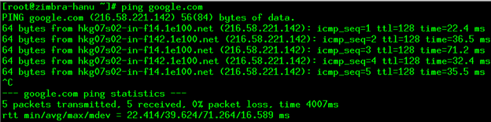
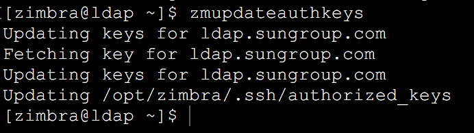
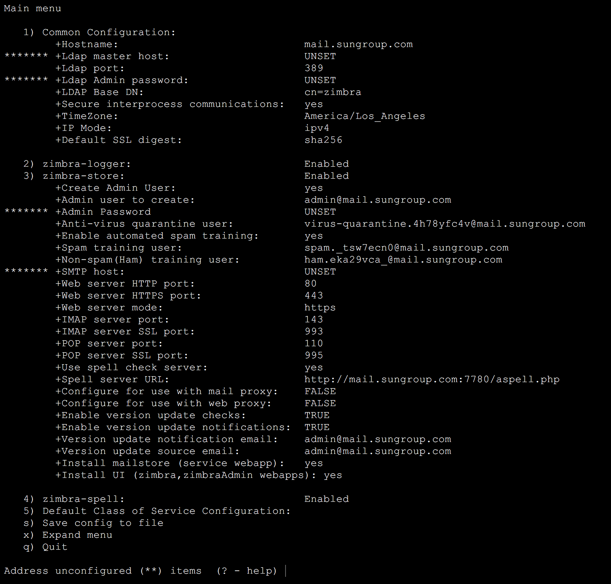
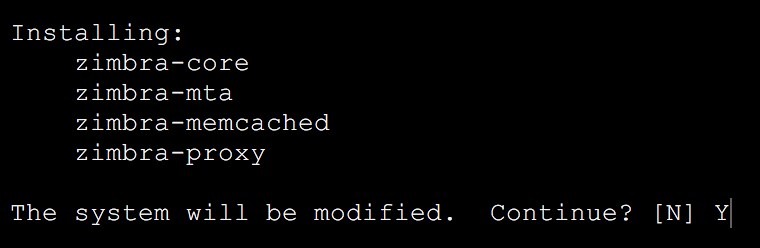
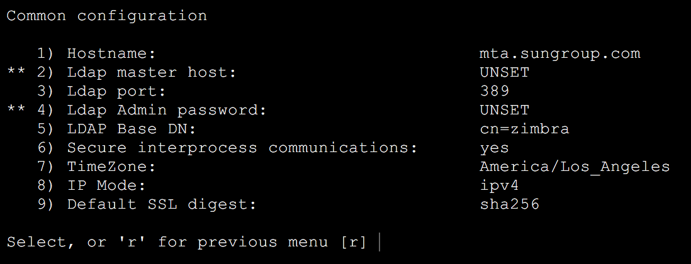

Hướng dẫn sử dụng Zimbra

**Mục lục**

**Mở đầu**

**Phần 1: Hướng dẫn cài đặt hệ thống mail Zimbra- mô hình một máy chủ**

**Phần 2: Hướng dẫn cài đặt hệ thống mail Zimbra – mô hình nhiều máy chủ**

**Phần 3: Hướng dẫn cập nhật hệ thống mail Zimbra**

**Phần 4: Hướng dẫn backup – restore hệ thống mai Zimbra**

**Phần 5: Hướng dẫn sửa giao diện đăng nhập người dung cuối**

**Phần 6: Hướng dẫn chuyển đổi hệ thống mail Zimbra**

**Lời mở đầu**

**Phần 1: Hướng dẫn cài đặt hệ thống mail Zimbra- mô hình một máy chủ**

**I, Chuẩn bị:**

1. ***Cài đặt hostname***

[root@mail:~] # vi /etc/hostname

`               `*Figure  SEQ Figure \\* ARABIC 1 sửa file cấu hình hostname*

`     `[root@ldap ~]# vi /etc/sysconfig/selinux

`                                                        `*Figure  SEQ Figure \\* ARABIC 2 sửa file cấu hình selinux*

1. ***Reboot máy để nhận hostname***

[root@mail:~] # reboot

1. ***Kiểm tra kết quả sau khi thay đổi cấu hình***

[root@mail:~] # hostname

`             `*Figure  SEQ Figure \\* ARABIC 3 kiểm tra hostname*

1. ***Cấu hình card mạng “eno16777736”***

[root@mail:~] # vi /etc/sysconfig/network-script/ifcfg-eno16777736

`                      `*Figure  SEQ Figure \\* ARABIC 4 Cấu hình card mạng*

1. ***Khởi động lại dịch vụ mạng***

[root@mail:~] # systemctl restart network

1. ***Kiểm tra thông tin card mạng***

[root@mail:~] # ip addr

`                                                     `*Figure  SEQ Figure \\* ARABIC 5 Kiểm tra ip address*

1. ***Kiểm tra kết nối mạng***

[root@mail:~] # ping google.com

`                                                      `*Figure  SEQ Figure \\* ARABIC 6 Kiểm tra network*

1. ***Cài đặt một số công cụ hỗ trợ***

[root@mail~] # rpm -Uvh <http://dl.fedoraproject.org/pub/epel/epel-release-latest-7.noarch.rpm>

[root@mail~] # rpm -Uvh http://rpms.famillecollet.com/enterprise/remi-release-5.rpm

[root@mail~] #yum install wget screen lsof rsync nmap net-tools unzip sudo sysstat perl-core -y

1. ***Update hệ điều hành - optional***

[root@mail~] #yum update -y

1. ***Reboot***

[root@mail:~] # reboot

**II, Cài đặt DNS:**

1. ***Cài đặt webmin và DNS:***

*[root@mail /]# vi /etc/yum.repos.d/webmin.repo*

*[Webmin]*

*name=Webmin Distribution Neutral*

*#baseurl=http://download.webmin.com/download/yum*

*mirrorlist=http://download.webmin.com/download/yum/mirrorlist*

*enabled=1*

*[root@mail /]# rpm --import http://www.webmin.com/jcameron-key.asc*

*[root@mail /]# yum install webmin perl-Net-SSLeay -y*

*[root@mail /]# service webmin start*

*[root@mail /]# lsof -i :10000*

*[root@mail /]# chkconfig webmin on*

[root@mail~] # yum install bind bind-utils bind-chroot -y

truy cập địa chỉ: <https://ip_máy:10000>

khởi tạo create master zone và các bản ghi:

hanu.vn A ip\_máy 

zimbra.hanu.vn A ip\_máy

hanu.vn MX zimbra.hanu.vn

1. ***Sửa file named.conf***

[root@mail:~] # vi /etc/named.conf

`                               `*Figure  SEQ Figure \\* ARABIC 7 Sửa file named.conf*

*listen-on port 53 { any; }*

*allow-query        {localhost; dải\_ip\_máy/24; }*

1. ***Start và enable dịch vụ***

[root@mail:~] #systemctl enable named

[root@mail:~] #systemctl start named

1. ***Tạo rule cho firewall cho phép sử dụng DNS - optional***

***Tắt hẵn firewall:***

[root@mail:~] #systemctl stop firewalld

[root@mail:~] #systemctl disable firewalld

***OR***

[root@mail:~] #systemctl enable firewalld

[root@mail:~] #systemctl start firewalld

firewall-cmd --permanent --zone=public --add-port=443/tcp 

firewall-cmd --permanent --zone=public --add-port=3930/tcp

firewall-cmd --permanent --zone=public --add-port=110/tcp

firewall-cmd --permanent --zone=public --add-port=25/tcp           	

firewall-cmd --permanent --zone=public --add-port=143/tcp         	

firewall-cmd --permanent --zone=public --add-port=993/tcp         	

firewall-cmd --permanent --zone=public --add-port=389/tcp         	

firewall-cmd --permanent --zone=public --add-port=995/tcp         	

firewall-cmd --permanent --zone=public --add-port=7025/tcp

firewall-cmd --permanent --zone=public --add-port=5800/tcp

firewall-cmd --permanent --zone=public --add-port=5900/tcp

firewall-cmd --permanent --zone=public --add-port=7071/tcp 	

firewall-cmd --permanent --zone=public --add-port=3894/tcp

firewall-cmd --permanent --zone=public --add-port=3895/tcp

firewall-cmd --permanent --zone=public --add-port=80/tcp  

firewall-cmd --reload

***Reload lại rule firewall***

[root@mail ~] # firewall-cmd --list-all

*Xem lai cac rule vua dat*

1. **Sửa file hosts**

` `[root@mail~] #vi /etc/hosts

`                                                          `*Figure  SEQ Figure \\* ARABIC 8 Sửa file hosts*

1. ***Kiểm tra phân giải tên miền***

1. ***Disable service postfix***

[root@mail ~] # systemctl stop postfix

[root@mail ~] # systemctl disable postfix

**III, Cấu hình và cài đặt Mail Zimbra**

1. ***Download Zimbra CS NE 8 (8.6) về máy client***

[root@mail~] #cd /

[root@mail/] #wget[` `*https://files.zimbra.com/downloads/8.6.0_GA/zcs-8.6.0_GA_1153.RHEL7_64.20141215151110.tgz*](https://files.zimbra.com/downloads/8.6.0_GA/zcs-8.6.0_GA_1153.RHEL7_64.20141215151110.tgz)

*Ta tiến hành giải nén Zimbra đã tải về trong thư mục setupzimbra*

[root@mail ~] # cd /

[root@mail /] #tar -vxzf zcs-8.6.0\_GA\_1153.RHEL7\_64.20141215151110.tgz

1. ***Cài đặt zimbra***

[root@mail/] #cd /zcs-8.6.0\_GA\_1153.RHEL7\_64.20141215151110

[root@mail tar xzf zcs-8.6.0\_GA\_1153.RHEL7\_64.20141215151110]#./install.sh -platform-override

*Do you agree the the term of the software license agreement ?* *Y*

*Tiếp tục là yêu cầu lựa chọn các gói để cài đặt. Ta cấu hình như sau :*

*gói zimbra-dnscache chọn N*

`                                    `*Figure  SEQ Figure \\* ARABIC 9 Chọn các gói zimbra*

*Tiếp tục , ta chọn 6 để vào zimbra-store:*

`                                             `*Figure  SEQ Figure \\* ARABIC 10 hướng dẫn cài đặt*

*Chọn 4 để cài đặt password : 123456a@*

`                                             `*Figure  SEQ Figure \\* ARABIC 11 Đặt mật khẩu cho tài khoản mail admin*

*Làm theo các bước trong hình*

`                                      `*Figure  SEQ Figure \\* ARABIC 12 Các bước hướng dẫn cài đặt*

*change domain name: N*

1. ***Kiểm tra trạng thái của service của Mail Zimbra***

*[root@mail~] #su - zimbra*

*[zimbra@mail ~]$ zmcontrol status*

`                         `*Figure  SEQ Figure \\* ARABIC 13 Trạng thái các dịch vụ zimbra*

1. ***Kiểm tra***
- *Truy cập https:// ip\_máy:7071 - giao diện quản trị zimbra server của admin*
- *Truy cập https://ip\_máy - giao diện webmail của người dùng. sau khi cài đặt xong, test gửi- nhận mail, nếu gửi nhận thành công là đạt.*

**Phần 2: Hướng dẫn cài đặt hệ thống mail Zimbra – mô hình nhiều máy chủ**

**I, Xây dựng mô hình**

|**Zimbra LDAP server và DNS server**|
| :- |
|Zimbra Version|zcs-8.6.0\_GA\_1153.RHEL7\_64.20141215151110|
|Hệ điều hành|CentOS Linux 7 (Core)|
|Hostname|ldap.sungroup.com|
|IP addr|192.168.50.237|

|**Zimbra Mailbox server**|
| :- |
|Zimbra Version|zcs-8.6.0\_GA\_1153.RHEL7\_64.20141215151110|
|Hệ điều hành|CentOS Linux 7 (Core)|
|Hostname|mail.sungroup.com|
|IP addr|192.168.50.238|

|**Zimbra MTA và Proxy server**|
| :- |
|Zimbra Version|zcs-8.6.0\_GA\_1153.RHEL7\_64.20141215151110|
|Hệ điều hành|CentOS Linux 7 (Core)|
|Hostname|mta.sungroup.com|
|IP addr|192.168.50.239|

*Figure  SEQ Figure \\* ARABIC 14: mô hình zimbra multi- server*

**I, Chuẩn bị:**

1. ***Cài đặt hostname***

[root@mail:~] # vi /etc/hostname

`          `*Figure  SEQ Figure \\* ARABIC 15 Sửa file cấu hình hostname*

`                                             `*Figure  SEQ Figure \\* ARABIC 16 Sửa file cấu hình selinux*

1. ***Reboot máy để nhận hostname***

[root@mail:~] # reboot

1. ***Kiểm tra kết quả sau khi thay đổi cấu hình***

[root@mail:~] # hostname

`            `*Figure  SEQ Figure \\* ARABIC 17 Kiểm tra hostname*

1. ***Cấu hình card mạng “eno16777736”***

[root@mail:~] # vi /etc/sysconfig/network-script/ifcfg-eno16777736

`                       `*Figure  SEQ Figure \\* ARABIC 18 Cấu hình card  mạng*

1. ***Khởi động lại dịch vụ mạng***

[root@mail:~] # systemctl restart network

1. ***Kiểm tra thông tin card mạng***

[root@mail:~] # ip addr

`                                                        `*Figure  SEQ Figure \\* ARABIC 19 Kiểm tra ip address*

1. ***Kiểm tra kết nối mạng***

[root@mail:~] # ping google.com

`                                                       `*Figure  SEQ Figure \\* ARABIC 20 Kiểm tra network*

1. ***Cài đặt một số công cụ hỗ trợ***

[root@mail~] # rpm -Uvh <http://dl.fedoraproject.org/pub/epel/epel-release-latest-7.noarch.rpm>

[root@mail~] # rpm -Uvh http://rpms.famillecollet.com/enterprise/remi-release-5.rpm

[root@mail~] #yum install wget screen lsof rsync nmap net-tools unzip sudo sysstat perl-core

1. ***Update hệ điều hành - optional***

[root@mail~] #yum update -y

1. ***Reboot***

[root@mail:~] # reboot

**II, Cài đặt DNS:**

1. ***Cài đặt webmin và DNS:***

*[root@mail /]# vim /etc/yum.repos.d/webmin.repo*

*[Webmin]*

*name=Webmin Distribution Neutral*

*#baseurl=http://download.webmin.com/download/yum*

*mirrorlist=http://download.webmin.com/download/yum/mirrorlist*

*enabled=1*

*[root@mail /]# rpm --import http://www.webmin.com/jcameron-key.asc*

*[root@mail /]# yum install webmin perl-Net-SSLeay*

*[root@mail /]# service webmin start*

*[root@mail /]# lsof -i :10000*

*[root@mail /]# chkconfig webmin on*

[root@mail~] # yum install bind bind-utils bind-chroot –y

truy cập địa chỉ: <https://ip_máy:10000>

khởi tạo create master zone và các bản ghi:

- sungroup.com.	IN	NS	ldap.sungroup.com.
- sungroup.com.	IN	NS	mail.sungroup.com.
- sungroup.com.	IN	NS	mta.sungroup.com.
- sungroup.com.	IN	MX	10 mta.sungroup.com.
- ldap.sungroup.com.	IN	A	192.168.50.237
- mail.sungroup.com.	IN	A	192.168.50.238
- mta.sungroup.com.	IN	A	192.168.50.239

1. ***Sửa file named.conf***

[root@mail:~] # vi /etc/named.conf

`                              `*Figure  SEQ Figure \\* ARABIC 21 Cấu hình file named.conf*

*listen-on port 53 { any; }*

*allow-query        {localhost; dải\_ip\_máy/24; }*

1. ***Start và enable dịch vụ***

[root@mail:~] #systemctl enable named

[root@mail:~] #systemctl start named

1. ***Tạo rule cho firewall cho phép sử dụng DNS - optional***

***Tắt hẵn firewall:***

[root@mail:~] #systemctl stop firewalld

[root@mail:~] #systemctl disable firewalld

***OR***

[root@mail:~] #systemctl enable firewalld

[root@mail:~] #systemctl start firewalld

firewall-cmd --permanent --zone=public --add-port=443/tcp 

firewall-cmd --permanent --zone=public --add-port=3930/tcp

firewall-cmd --permanent --zone=public --add-port=110/tcp

firewall-cmd --permanent --zone=public --add-port=25/tcp

firewall-cmd --permanent --zone=public --add-port=143/tcp 

firewall-cmd --permanent --zone=public --add-port=993/tcp 

firewall-cmd --permanent --zone=public --add-port=389/tcp 

firewall-cmd --permanent --zone=public --add-port=995/tcp 

firewall-cmd --permanent --zone=public --add-port=7025/tcp

firewall-cmd --permanent --zone=public --add-port=5800/tcp

firewall-cmd --permanent --zone=public --add-port=5900/tcp

firewall-cmd --permanent --zone=public --add-port=7071/tcp 	

firewall-cmd --permanent --zone=public --add-port=3894/tcp

firewall-cmd --permanent --zone=public --add-port=3895/tcp

firewall-cmd --permanent --zone=public --add-port=80/tcp  

firewall-cmd --reload

***Reload lại rule firewall***

[root@mail ~] # firewall-cmd --list-all

*Xem lai cac rule vua dat*

1. **Sửa file hosts**

` `[root@mail~] #vi /etc/hosts

`                                                        `*Figure  SEQ Figure \\* ARABIC 22Kiểm tra file hosts*

1. ***Kiểm tra phân giải tên miền***

1. ***Disable service postfix***

[root@mail ~] # systemctl stop postfix

[root@mail ~] # systemctl disable postfix

**III, MULTI-SERVER INSTALLATION**

1. **Thứ tự cài đặt**
   - Zimbra LDAP server
   - Zimbra Mailbox server
   - Zimbra MTA và Proxy server

*Chú ý: Trước khi tiến hành cài đặt, thời gian hệ thống của các server phải được đồng bộ (đã thực hiện ở bước 5.6). Trường hợp thời gian không được đồng bộ chuẩn, các server không thể trao đỏi dữ liệu thống kê tình trạng hệ thống.*

*Chú ý: Thứ tự cài đặt có thể linh hoạt thay đổi nhưng bắt buộc ldap server phải được cài đặt đầu tiên*

1. **Chuẩn bị**
   1. Tải phiên bản Zimbra Collaboration - Open Source Edition, version 8.6 từ trang chủ của[ Zimbra](https://www.zimbra.com/downloads/zimbra-collaboration-open-source), lưu file tar này vào các máy chủ.
   1. **Thực hiện các bước sau với tất cả server:**
1. Chuyển thư mục làm việc tới nơi  lưu trữ file cài đặt Zimbra, trong ví dụ này, file cài đặt được lưu tại **/root**.
1. Giải nén file cài đặt:

[root@ldap ~]# tar xzvf <tên file>

1. Di chuyển vào thư mục vừa giải nén

[root@ldap ~]# cd zcs-8.6.0\_GA\_1153.RHEL7\_64.20141215151110/

Sau đó chạy câu lệnh .**./install.sh --platform-override**

1. Zimbra sẽ tự động kiểm tra yêu cầu hệ thống trước khi cài đặt: bao gồm các gói phụ thuộc, file host, dịch vụ xung đột (sendmail, postfix…). Nếu gặp lỗi ở đây, quá trình cài đặt sẽ tự động dừng lại, các thông báo lỗi sẽ được hiện thị rõ ràng, dựa vào thông báo lỗi này để quyết định hướng xử lý tiếp theo

Câu lệnh để cài đặt các gói phần mềm: **yum install <tên gói>**

1. Cài đặt LDAP Server11:46 lib64 -> usr/lib64
1. drwxr-xr-x.   2 root root    6 Apr 11
1. Thực hiện các bước 6.2
1. Xác nhận các các gói zimbra sẽ được cài đặt. Chỉ chọn **Y (yes)** với gói **zimbra-ldap**. Các gói còn lại lựa chọn **N (no)**.

*Chú ý: Trường hợp gói zimbra-snmp được sử dụng, thì nó phải được cài đặt trên tất cả các máy chủ khác.*

1. Gõ **Y** và nhấn **Enter** để bắt đầu cài đặt.

*Figure  SEQ Figure \\* ARABIC 23 Cài đặt các gói trên Ldap server*

1. Thay đổi **domain name**. Gõ **Yes** và nhấn **Enter**, sau đó điền **domain name** và nhấp **Enter** để xác nhận.

`                                          `*Figure  SEQ Figure \\* ARABIC 24 Quá trình cài đặt Ldap server*

1. Hoàn tất cài đặt các gói phần mềm 

*Figure  SEQ Figure \\* ARABIC 25 Hoàn thành quá trình cài đặt*

1. Gõ **1** và nhấn **Enter** để vào menu **Common Configuration**:

*Figure  SEQ Figure \\* ARABIC 26 Menu common configuration máy chủ ldap*

1. Gõ **4** và nhấn **Enter** để đặt  mật khẩu **Ldap Admin Password**. Lưu trữ mật khẩu này lại, mật khẩu này dùng để cấu hình trong quá trình cài đặt **mailbox** và **mta server** sau đây.
1. Gõ **6** và nhấp **Enter** sau đó chỉnh lại múi giờ.
1. Gõ **r** để quay lại menu chính
1. Gõ **a** và nhấp **Enter** để áp dụng cấu hình.
1. Khi thông báo **“Save configuration data to a file?”** gõ **Yes** và nhấp **Enter**
1. Khi thông báo **“The system will be modified - continue?”** Gõ **Y** và nhấp **Enter** để tiếp tục cài đặt.

*Figure  SEQ Figure \\* ARABIC 27 Quá trình cài đặt*

1. Khi thông báo **“Configuration complete - press return to exit”** hiện ra, nhấp **Enter** để kết thúc.
1. Kiểm tra các dịch vụ của zimbra

[root@ldap ~]# su - zimbra

[zimbra@ldap ~]$ zmcontrol status

*Figure  SEQ Figure \\* ARABIC 28 Kiểm tra dịch vụ Zimbra*

1. **QUAN TRỌNG**: Cập nhật các khoá xác thực. Trường hợp cài đặt zimbra trên nhiều server, bắt buộc phải chạy câu lệnh sau đây sau khi hoàn tất cài đặt và cầu hình ldap server, nếu không các server khác (mailbox và mta) sẽ không thể giao tiếp với LDAP server. (Lỗi Ldap Admin Password: not verified)

[root@ldap ~]$ su – zimbra

[zimbra@ldap ~]$ zmupdateauthkeys

*Figure  SEQ Figure \\* ARABIC 29 Cập nhật khóa xác thực zimbra*

1. Khởi động lại các dịch vụ của Zimbra

[zimbra@ldap ~]$ zmcontrol restart

**Qúa trình cài đặt và cấu hình LDAP server hoàn tất**

1. ` `**Cài đặt Mailbox**
1. Thực hiện các bước 6.2
1. Đồng ý với điều khoản

*Figure  SEQ Figure \\* ARABIC 30 Đồng ý với các điều khoản*

1. Lựa chọn các gói **zimbra-logger, zimbra-store, zimbra-apache, zimbra-spell** để cài đặt.

*Figure  SEQ Figure \\* ARABIC 31 Các gói zimbra cài đặt trên máy chủ mailbox*

1. Gõ **Y** và nhấn **Enter** để cài đặt

*Figure  SEQ Figure \\* ARABIC 32 Xác nhận cài đặt*

1. Hoàn tất cài đặt các gói, bắt đầu cấu hình zimbra

*Figure  SEQ Figure \\* ARABIC 33 Menu cấu hình máy chủ mailbox*

1. Gõ **1** và nhấp **Enter** để vào menu **Common Configuration**

*Figure  SEQ Figure \\* ARABIC 34 Menu cấu hình common configuration*

- Gõ **2** và nhấp **Enter**, sau đó điền **Ldap Hostname (ldap.Sungroup.Com)**
- Gõ **4** và nhấp **Enter**, sau đó điền **Ldap Admin Password**.

Chú ý: có thể lấy mật khẩu **Ldap Admin**, bằng cách đăng nhập vào máy chủ ldap, sau đó sử dụng các câu lệnh sau.

**[root@ldap ~]# su - zimbra**

**[zimbra@ldap ~]$ zmlocalconfig -s zimbra\_ldap\_password**

Sau khi cập nhật các giá trị này, mailbox server sẽ tự động kết nối tới ldap server. Nếu quá trình này thất bại, không thể tiếp tục quá trình cài đặt.

- Gõ **7** và nhấn **Enter**, sau đó chỉnh lại timezone. (Việt Nam - 37)
- Gõ **r** và nhấn **Enter** để quay lại menu chính

`                                    `*Figure  SEQ Figure \\* ARABIC 35 Các gói cài đặt trên mailbox*

1. Gõ **3** và nhấp **Enter** để vào menu cấu hình **zimbra-store**

*Figure  SEQ Figure \\* ARABIC 36 Menu cấu hình zimbra-store*

- Gõ **4** và nhấp **Enter**, sau đó đặt mật khẩu cho tài khoản admin
- Gõ **6** và nhấp **Enter**, sau đó cập nhật **SMTP host**, ở đây chình là **hostname** của **MTA server (mta.sungroup.com)**
- Nếu **zimbra-proxy** không được cài đặt cùng với **Mailbox Server**, có thể cấu hình trước mailbox server để sử dụng proxy server sau này. Đặt 1 trong 2 (hoặc cả 2 thuộc tính) sau về **True**
  - **Configure for use with mail proxy** 
  - **Configure for use with web proxy** 
1. Gõ **r** và nhấn **Enter** để quay lại menu trước
1. Gõ a và nhấp Enter để áp dụng cấu hình.
1. Khi thông báo **“Save configuration data to a file?”** gõ **Yes** và nhấp **Enter**
1. Khi thông báo **“The system will be modified - continue?”** Gõ **Y** và nhấp **Enter** để tiếp tục cài đặt.

*Figure  SEQ Figure \\* ARABIC 37 Hoàn tất cài đặt và cấu hình máy chủ mailbox*

1. Khi thông báo **“Configuration complete - press return to exit”** hiện ra, nhấp **Enter** để kết thúc.
1. Kiểm tra các dịch vụ của zimbra

**[root@ldap ~]# su - zimbra**

**[zimbra@ldap ~]$ zmcontrol status**

*Figure  SEQ Figure \\* ARABIC 38 Kiểm tra các dịc h vụ zimbra trên máy chủ mailbox*

**Qúa ttrình cài đặt vầ cấu hình MAILBOX server hoàn tất.**

1. ` `**Cài đặt MTA và proxy**
   1. Thực hiện các bước 6.2
   1. Đồng ý với điều khoản

*Figure  SEQ Figure \\* ARABIC 39 Đồng ý với các điều khoản*

1. Lựa chọn các gói **zimbra-mta, zimbra-memcached** và **zimbra-proxy** để cài đặt

*Figure  SEQ Figure \\* ARABIC 40 Các gói zimbra cài đặt trên máy chủ MTA- proxy*

1. Gõ **Y** và nhấn **Enter** để bắt đầu cài đặt

*Figure  SEQ Figure \\* ARABIC 41 Xác nhận cài đặt*

1. Hoàn tất cài đặt các gói, bắt đầu cấu hình zimbra

*Figure  SEQ Figure \\* ARABIC 42 Menu cấu hình máy chủ MTA-proxy*

1. Gõ **1** và nhấn **Enter** để vào menu **Common Configuration.**

*Figure  SEQ Figure \\* ARABIC 43 Menu cấu hình common configuration máy chủ MTA-proxy*

- Gõ **2** để điền **Ldap Master Host**.
- Gõ 3 để điền **Ldap Admin Password**. Sau khi điền password, mta server sẽ tự động kết nối tới ldap server, nếu thất bại, quá trình cài đặt không thể tiếp tục.
- Gõ **7** và nhấn **Enter**, sau đó cập nhật lại timezone
- Gõ **r** và nhấn **Enter** để quay lại menu chính
  1. Gõ **2** và nhấn **Enter** để vào menu cài đặt **zimbra-mta**

*Figure  SEQ Figure \\* ARABIC 44 menu cấu hình zimbra MTA-proxy*

- Gõ **6** và nhấn **Enter**, sau đó điền **postfix ldap password**
- Gõ **7** và nhấn **Enter**, sau đó điền **amivis ldap password**

Chú ý: để lấy mật khẩu ldap, đăng nhập vào máy chủ ldap, sau đó sử dụng các câu lệnh sau.

[root@ldap ~]# su – zimbra

[zimbra@ldap ~]$ zmlocalconfig –s ldap\_postfix\_password

[zimbra@ldap ~]$ zmlocalconfig –s ldap\_amavis\_password 

- Gõ **r** và nhấn **Enter** để quay lại màn hình chính
  1. Gõ **3** và nhấn **Enter** để cấu hình **zimbra-proxy**

*Figure  SEQ Figure \\* ARABIC 45 Menu cấu hình zimbra MTA- proxy*

- Gõ **11** và nhấn **Enter** để cấu hình **ldap nginx password**

Chú ý: để lấy mật khẩu ldap postfix, đăng nhập vào máy chủ ldap, sau đó sử dụng các câu lệnh sau.

[root@ldap ~]# su – zimbra

[zimbra@ldap ~]$ zmlocalconfig –s ldap\_postfix\_password

or

`	`su zimbra 

`	`zmlocalconfig -s | grep ldap\_amavis\_password 

`	`zmlocalconfig -s | grep ldap\_nginx\_password 

`	`zmlocalconfig -s | grep ldap\_postfix\_password 

`	`zmlocalconfig -s | grep ldap 

`	`numplication\_password zmlocalconfig -s | grep ldap\_root\_password 

`	`zmlocalconfig -s | grep zimbra\_ldap\_password

- Gõ **r** và nhấn **Enter** để quay lại menu trước
  1. Gõ **a** và nhấn **Enter** để áp dụng cấu hình
  1. Khi thông báo “Save configuration data to a file?” gõ Yes và nhấp Enter
  1. Khi thông báo **“The system will be modified - continue?”** Gõ **Y** và nhấp **Enter** để tiếp tục cài đặt.
  1. Khi thông báo **“Configuration complete - press return to exit”** hiện ra, nhấp **Enter** để kết thúc.
  1. Kiểm tra các dịch vụ của zimbra

[root@ldap ~]# su - zimbra

[zimbra@ldap ~]$ zmcontrol status

*Figure  SEQ Figure \\* ARABIC 46 Kiểm tra dịch vụ zimbra trên máy MTA-proxy*

**Cài đặt và cấu hình MTA và Proxy server hoàn tất.**

1. ` `**Các bước sau cài đặt**

*Chú ý: Thực hiện các bước sau trên tất cả các server, ở đây chỉ lấy máy chủ ldap làm ví dụ*

1. Thiết lập khóa xác thực giữa các server

[root@mta zcs]# su – zimbra

[zimbra@mta ~]$ zmupdateauthkeys

Khoá ssh được cập nhật tại: **/opt/zimbra/.ssh/authorized\_keys**

*Figure  SEQ Figure \\* ARABIC 47 Cập nhật khóa xác thực*

1. Cấu hình **rsyslog** trên Centos
- Chạy câu lệnh: **/opt/zimbra/libexec/zmsyslogsetup**
- Mở file **rsyslog.conf** bằng câu lệnh **vim /etc/rsyslog.conf**
- Uncomment các dòng sau:

**# Provides UDP syslog reception** 

**#$ModLoad imudp** 

**#$UDPServerRun 514**

**# Provides TCP syslog reception** 

**#$ModLoad imtcp** 

**#$InputTCPServerRun 514**

*Figure  SEQ Figure \\* ARABIC 48 Cấu hình file rsyslog*

1. **Kiểm tra cấu hình server**

[root@mta zcs]# su - zimbra

[zimbra@mta ~]$ zmcontrol status

1. **Đăng nhập vào hệ thống**
   1. Admin Console: **https://<mailbox-ip>:7071/zimbraAdmin/**

*Ảnh  55: Kiểm tình trạng các dịch vụ zimbra qua Zimbra Admin Console*

1. Hệ thống mail zimbra: **htts://<mailbox ip>**

**Cấu hình Zimbra mô hình multi-server hoàn tất.**

**Phần 3: Hướng dẫn cập nhật hệ thống mail Zimbra**

**I, Chuẩn bị**

***Các bước chuẩn bị trước khi nâng cấp:***

1. Stop chính thức dịch vụ trên toàn bộ máy chủ của hệ thống mail Production cũ
1. Sử dụng tài khoản zimbra:

[root@mail ~] su - zimbra

1. Tắt các dịch vụ :

[root@mail ~] zmcontrol stop

1. Xử lý hiện tượng thư gửi nội bộ đến hòm thư người nhậm bị chậm (delay mất ít phút thư mới gửi đến hòm thư người nhận)
1. Backup dữ liệu mail mới nhất & Kiểm tra dữ liệu Backup
1. Cập nhật hệ điều hành máy chủ

[root@mail ~]  yum update

1. Kiểm tra ngày giờ, hệ điều hành, đảm bảo Zimbra 8.0.7 hoạt động bình thường trên môi trường mới

**II, Nâng cấp Zimbra 8.6.0 lên Zimbra 8.7.5**

***1. Download zimbra ZCS 8.7.5***

[root@mail ~] cd /

[root@mail ~] wget <https://files.zimbra.com/downloads/8.7.5_GA/zcs-8.7.5_GA_1764.RHEL6_64.20170314032533.tgz>

***2. Nâng cấp zimbra 8.6 lên zimbra 8.7.5***

[root@mail ~] cd /

[root@mail ~] tar -zxvf zcs-8.7.5\_GA\_1764.RHEL6\_64.20170314032533.tgz

[root@mail ~] cd zcs-8.7.5\_GA\_1764.RHEL6\_64.20170314032533.tgz

[root@mail ~] ./install.sh --platform-override

Note: Đảm bảo hệ tthống có đủ 2 thành phần là zimbra-proxy và zimbra-memcached, thiếu 1 trong 2 thành phần này, trình update sẽ bị huỷ bỏ do từ bản 8.7.0, proxy và memcached là 2 thành phần bắt buộc. 

`                              `

Các điều khoản của Zimbra được hiển thị. Gõ "y" để đồng ý và tiếp tục

`                               `

Use Zimbra's packaging server [Y] hiển thị, bấm Enter để tiếp tục. Hệ thống sẽ được sử dụng repository của Zimbra cho yum hay apt-get để nó có thể cài đặt các gói từ Zimbra.

`                               `

Khi được hỏi Do you wish to upgrade? [Y] nhấn enter để tiếp tục. Các gói nâng cấp được mở gói.

`                               `

Khi hiển thị The system will be modified. Continue? [N] nhập Y và nhấn enter. Stop dịch vụ trên các máy chủ Zimbra, và các gói cũ được loại bỏ. Quá trình nâng cấp sẽ xác định phiên bản của ZCS đang được chạy và bắt đầu tiến hành nâng cấp, phục hồi các file cấu hình sẵn có, và khởi động lại máy chủ.

`                               `

3. ***Sau khi hoàn thành update phiên bản 8.7.x, chạy các lệnh sau để sửa lại các giá trị mặc định globalconfig***:

[root@mail ~] zmprov mcf zimbraMtaCommandDirectory /opt/zimbra/common/sbin

[root@mail ~] zmprov mcf zimbraMtaDaemonDirectory /opt/zimbra/common/libexec

[root@mail ~] zmprov mcf zimbraMtaMailqPath /opt/zimbra/common/sbin/mailq

[root@mail ~] zmprov mcf zimbraMtaManpageDirectory /opt/zimbra/common/share/man

[root@mail ~] zmprov mcf zimbraMtaNewaliasesPath /opt/zimbra/common/sbin/newaliases

[root@mail ~] zmprov mcf zimbraMtaSendmailPath /opt/zimbra/common/sbin/sendmail

**Note**: DSPAM khong hoạt động từ zimbra 8.7 ,hãy làm theo các bước sau để disable nó.

[root@mail ~] zmprov ms `zmhostname` zimbraAmavisDSPAMEnabled FALSE

[root@mail ~] zmlocalconfig -e amavis\_dspam\_enabled=false

[root@mail ~] zmamavisdctl restart

Hoàn thành upgrade zimbra 8.6 lên 8.7.x

**Phần 4: Hướng dẫn backup – restore hệ thống mai Zimbra**

**I, Chuẩn bị**

***1.Tắt các dịch vụ zimbra đang chạy để đảm bảo khi backup ko xảy ra mất dữ liệu***

[root@mail ~] su - zimbra

[root@mail ~] zmcontrol stop

**II,  Backup dữ liệu:**

[root@mail ~] cp -r /opt/zimbra /[destination]/zimbra\_backup\_260217

**III, Restore dữ liệu:**

***1.Thay đổi tên file zimbra cũ***

[root@mail ~] mv /opt/zimbra /opt/zimbra\_broken

***2.Copy thư mục backup đến /opt***

[root@mail ~] cp -rp /[destination]/zimbra\_backup /opt

***3.Đổi tên thư mục backup***

[root@mail ~] mv /opt/zimbra\_backup /opt/zimbra

***4.Thay đổi quyền cho thư mục /zimbra mới  :***

[root@mail ~] chown -R zimbra:zimbra /opt/zimbra/store

[root@mail ~] chown -R zimbra.zimbra /opt/zimbra/index

**NOTE:** Đôi khi bạn sẽ tìm thấy lỗi do thay đổi quyền truy cập vào các tệp tin hoặc thư mục trong thư mục Zimbra / opt / zimbra /. Để khắc phục sự cố này, hãy chạy lệnh zmfixperms.

Xác nhận rằng tất cả các quyền đều đúng trên máy chủ mới:

\1. Với tư cách là root, hãy chạy lệnh zmfixperms để sửa các vấn đề cho phép với tập tin dưới / opt / zimbra:

/opt/zimbra/libexec/zmfixperms

\2. Nếu bạn cần phải kiểm tra / opt / zimbra / store và / opt / zimbra / index, cần phải sử dụng tuỳ chọn -extended. Việc này sẽ mất nhiều thời gian hơn để chạy - có thể nhiều giờ trong môi trường lớn - vì vậy chỉ chạy khi cần thiết. Chạy lệnh này dưới dạng root:

/opt/zimbra/libexec/zmfixperms -extended 

**IV,Start dịch vụ zimbra:**

[root@mail ~] su - zimbra

[root@mail ~] zmcontrol start

**Phần 5: Hướng dẫn sửa giao diện đăng nhập người dung cuối**

**I, Các bước chuẩn bị:**

***1.Đưa 2 file (login.jsp, skins.tar.gz) len thư mục /tmp tren may chủ mail***

***Zimbra bằng cong cụ WinSCP***

***2.Giải nen file skins.tar.gz trong thư mục /tmp***

[root@mail ~]  cd /tmp/

[root@mail ~]  tar zxvf skins.tar.gz

***3. Backup file login.js trong thư mục /opt/zimbra/jetty/webapps/zimbra/public***

[root@mail ~]  mkdir -p /opt/zimbra-backup

[root@mail ~]  cp /opt/zimbra/jetty/webapps/zimbra/public/login.jsp

/opt/zimbra-backup/

***4. Backup thư mục /opt/zimbra/jetty/webapps/zimbra/skins***

[root@mail ~]  tar cvzf /opt/zimbra-backup/skins.tar.gz

/opt/zimbra/jetty/webapps/zimbra/skins/	

***5. Backup file zimbra.web.xml.in trong thư mục /opt/zimbra/jetty/etc***

[root@mail ~]  cp /opt/zimbra/jetty/etc/zimbra.web.xml.in /opt/zimbrabackup/

**II, Thực hiện triển khai**

***1. Copy file login.js trong thư mục /tmp đe len file login.jsp gốc***

[root@mail ~]  cp /tmp/login.jsp /opt/zimbra/jetty/webapps/zimbra/public/

Lưu y: Bấm “y” để overwrite file login.jsp gốc.

***2. Kiểm tra owner của file login.js mới va thay đổi owner “zimbra” trong***

***trường hợp file login.js mới được sở hữu bởi một user khac***

[root@mail ~]  ls -l /opt/zimbra/jetty/webapps/zimbra/public/login.jsp

Trường hợp phải thay đổi owner “zimbra”:

[root@mail ~]  chown zimbra.zimbra

/opt/zimbra/jetty/webapps/zimbra/public/login.jsp

***3. Chỉnh sửa file cấu hinh /opt/zimbra/jetty/etc/zimbra.web.xml.in để***

***luon luon sử dụng theme login mặc định la “bare” khi client truy cập***

***Webmail***

[root@mail ~]  vim /opt/zimbra/jetty/etc/zimbra.web.xml.in

Chỉnh sửa nội dung file cấu hinh như sau:

<context-param>

<param-name>zimbraDefaultSkin</param-name>

<param-value>bare</param-value>

</context-param>

Sau khi sửa xong, lưu file cấu hinh va thoat.

***4. Copy cac file trong thư mục /tmp/skins vao thư mục***

/opt/zimbra/jetty/webapps/zimbra/skins/

[root@mail ~]  cp -vR /tmp/skins/\* /opt/zimbra/jetty/webapps/zimbra/skins/

Lưu y: Bấm “y” để overwrite cac file gốc.

***5. Chown user va group “zimbra” cho 2 thư mục (\_base, serenity?)***

[root@mail ~]  chown -R zimbra.zimbra

/opt/zimbra/jetty/webapps/zimbra/skins/\_base

[root@mail ~]  chown -R zimbra.zimbra

/opt/zimbra/jetty/webapps/zimbra/skins/serenity

***6. Khởi động lại dịch vụ mailboxd của Zimbra va kiểm tra trạng thai***

cac dịch vụ khac của Zimbra

[root@mail ~]  su – zimbra

[root@mail ~]  zmmailboxdctl restart

[root@mail ~]  zmcontrol status

**Phần 6: Hướng dẫn chuyển đổi hệ thống mail Zimbra**

**I, Chuẩn bị** 

Sử dụng rsync để di chuyển từ một ZCS mailstore cũ sang một mailstore ZCS mới có thể được yêu cầu cho nhiều lý do:

\1. Chuyển từ một máy chủ 32-bit đến một máy chủ 64-bit

\2. Từ bỏ một hệ thống cũ vì nó bị hư hỏng, hỏng, vỡ, vv

\3. Chạy bản rsync liên tục của một mailstore ZCS cho các mục đích DR

\4. Chuyển từ một hệ điều hành đó là EOL để một trong đó là hiện tại, ví dụ:

- Chuyển từ CentOS 6 đến CentOS 7
- Chuyển từ Ubuntu 14.04 đến Ubuntu 16.04

**QUAN TRỌNG** : Các ZCS phát hành bạn cài đặt trên máy chủ mới phải giống ZCS Version như cài đặt trên Old Server. Các máy chủ có thể có một hệ điều hành khác nhau, nhưng phiên bản ZCS phải giống hệt nhau.

Ở đây, giải pháp là: ngừng Zimbra trên máy chủ nguồn, tạo bản sao lưu của / opt / Zimbra, cài đặt máy chủ mới, cài đặt ZCS phần mềm vào máy tính mới , thay thế / opt / Zimbra trên máy mới với các sao lưu đã được thực hiện từ các máy cũ, sửa chữa cho phép, chạy một ZCS bình thường cài đặt.

**II, Quy trình thực hiện**

***1.Trên máy chủ cũ:***

- chuyển sang tài khoản zimbra:

[root@mail ~] su - zimbra

- Dừng các dịch vụ zimbra đàn chạy

[root@mail ~] zmcontrol stop

[root@mail ~] exit

- Hãy chắc chắn rằng tất cả các dịch vụ Zimbra được dừng lại:

[root@mail ~] ps aux | grep zimbra 

- Sao chép thư mục /opt/zimbra đến một vị trí sao lưu,

[root@mail ~] rsync -e ssh -axvzKHS [source-location] [newserver-IP-address]:[destination-location]

VD: [root@mail ~] rsync -avHKSe 'ssh -p 8022' root@mail.securemail.vn:/backup/zimbradata/zimbra-full-backup/zimbra/ /mnt/backup/zimbra-securemail 

Dòng lệnh trên dùng để sync dữ liệu từ máy chủ cũ sang máy chủ mới bằng dịch vụ ssh. Hoặc dùng dòng lệnh sau :

[root@mail ~] rsync -ave 'ssh -p 8022' root@mail.securemail.vn:/backup/zimbradata/zimbra-full-backup/zimbra/ /mnt/backup/zimbra-securemail

- Sau khi sync dữ liệu từ máy chủ cũ về máy chủ mới, kiểm tra dung lượng của thư mục zimbra

[root@mail ~] du -sh /mnt/backup/zimbra-securemail

Nếu có sự chênh lệch dung lượng giữa 2 thư mục, vd: [root@mail ~]  /backup/zimbradata/zimbra-full-backup/zimbra/ và /mnt/backup/zimbra-securemail, sử dụng dòng lệnh sau:

[root@mail ~] rsync -e ssh --delete -axvzKHS [source-location] [newserver-IP-address]:[destination-location]

Dòng lệnh trên có tác dụng đồng bộ dữ liệu giữa 2 thư mục, xóa các thư mục/file thừa ở trong thư mục được backup.

***2.Trên máy chủ mới:***

- chuyển sang tài khoản zimbra:

[root@mail ~] su - zimbra

- Dừng các dịch vụ zimbra đàn chạy: 

[root@mail ~] zmcontrol stop

[root@mail ~] exit

- Hãy chắc chắn rằng tất cả các dịch vụ Zimbra được dừng lại: 

[root@mail ~] ps aux | grep zimbra 

- Đổi tên thư mục /opt/zimbra hiện tại

[root@mail ~] mv -r /opt/zimbra /opt/zimbra\_old

- Sync thư mục zimbra backup về /opt

[root@mail ~] rsync -avHKS [ thư mục nguồn] [ thư mục đích ]

Ví dụ:

[root@mail ~] rsync -av /mnt/zimbra-full-backup/ /opt/zimbra-backup-full

hoặc

[root@mail ~] rsync -avHKS /mnt/zimbra-full-backup/ /opt/zimbra-backup-full

**Note:** trường hợp thư mục backup zimbra được lưu tại ổ cứng ngoài hoặc lưu trữ trên NAS hoặc  SAN, cần thực hiện lệnh mount:

[root@mail ~] mount -t nfs backupwins:/zimbra /mnt

hoặc

[root@mail ~] mount -t cifs /backupwins:/zimbra /mnt/zimbra

Cuối cùng thực hiện các bước giống với restore zimbra.

