Tài liệu

Hướng dẫn xây dựng hệ thống mail zimbra - mô hình single mail

MỤC LỤC

1. Lên kế hoạch triển khai hệ thống
   1. Cài đặt hệ điều hành máy chủ
   1. Thiết lập cấu hình kết nối mạng
   1. Chuẩn bị phần mềm cài đặt máy chủ mail zimbra
   1. Cài đặt phần mềm máy chủ mail zimbr
1. Cài đặt hệ điều hành máy chủ
1. Thiết lập cấu hình kết nối mạng
   1. Cài đặt hostname
   1. Disable SELINUX
   1. Reboot máy để nhận hostname
   1. Kiểm tra kết quả sau khi thay đổi cấu hình
   1. Cấu hình card mạng “eth0”
   1. Khởi động lại dịch vụ mạng
   1. Kiểm tra thông tin card mạng
   1. Kiểm tra kết nối mạng
   1. Cài đặt một số công cụ hỗ trợ
   1. Update hệ điều hành
   1. reboot

\4.	Chuẩn bị cài đặt Zimbra

`	`4.1.	Cài đặt DNS

`	`4.2.	Sửa file named.conf

`	`4.3.	Tạo bản ghi phân giải

`	`4.4.	Start và enable dịch vụ

`	`4.5	Tạo rule cho firewall cho phép sử dụng DNS

`	`4.6	Kiểm tra các file DNS

`	`4.7.	Kiểm tra phân giải tên miền

`	`4.8.	Thêm # ở dòng Defaults requiretty trong Sudoers để tránh lỗi LDAP

4.9.	Disable một số dịch vụ xung đột với Zimbra

\5.	Cấu hình và cài đặt Zimbra

5.1	Download Zimbra CS NE 8 (8.6) về máy client

5.2 	Cài đặt zimbra

5.3	Kiểm tra trạng thái của service của Mail Zimbra

1. **Lên kế hoạch triển khai**
   1. ***Cài đặt hệ điều hành máy chủ***

Cài đặt hệ điều hành máy chủ CentOS 7 cho hệ thống Mail Zimbra

2. ***Thiết lập cấu hình kết nối mạng***

Thiết lập cấu hình kết nối mạng trên máy mail Zimbra, gồm:

\+ Địa chỉ IP, Subnetmask

\+ Gateway

\+ DNS

\+ hostname

3. ***Chuẩn bị phần mềm cài đặt máy chủ mail zimbra***

Một số bước cần chuẩn bị trước khi cài đặt phần mềm máy chủ thư Zimbra:

\+ Thay đổi timezone, thời gian hệ thống

Cài đặt date      

**Kiểm tra date:**

**[root@mail /]# date**

`	`**Cài đặt lại date:**

**[root@mail /]# date -s "Sat Sep 31 17:37:59 ICT 2016"**

\+ Thêm các kho phần mềm cần thiết

\+ Cập nhật HĐH máy chủ

\+ Cài đặt 1 số công cụ, tiện ích (cơ bản)

\+ Cài đặt 1 số công cụ, tiện ích (nâng cao)

\+ Thiết lập hệ thống DNS cục bộ

\+ Disable SELinux

**[root@mail /]# vi /etc/sysconfig/selinux**

` `**Thay đổi dòng “SELINUX=enforcing” thành “SELINUX=disabled”**

**SELINUX=disabled**

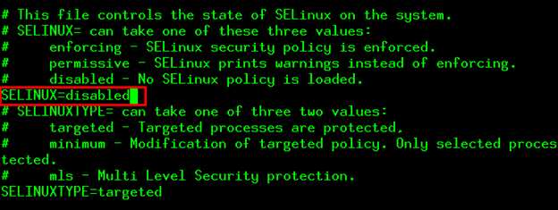

\+ Mở Port trên Firewall

\+ Disable 1 số dịch vụ xung đột với Zimbra

4. ***Cài đặt phần mềm máy chủ mail zimbra***

Cài đặt  và cấu hình phần mềm máy chủ thư ZCS 8.6, phiên bản NE

2. **Cài đặt hệ điều hành máy chủ**

Phần mềm máy chủ thư Zimbra được cài đặt trên HĐH máy chủ Linux: CentOS-7 (64-bit). Các bước cài đặt HĐH CentOS-7 được triển khai bình thường.

3. **Thiết lập cấu hình kết nối mạng**
   1. ***Cài đặt hostname***

**[root@mail:~] # vi /etc/hostname**

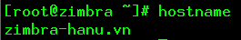

2. ***Reboot máy để nhận hostname***

**[root@mail:~] # reboot**

3. ***Kiểm tra kết quả sau khi thay đổi cấu hình***

**[root@mail:~] # hostname**

4. ***Cấu hình card mạng “eno16777736”***

**[root@mail:~] # vi /etc/sysconfig/network-script/ifcfg-eno16777736**

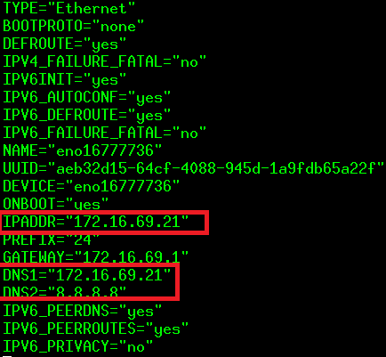

5. ***Khởi động lại dịch vụ mạng***

**[root@mail:~] # systemctl restart network**

6. ***Kiểm tra thông tin card mạng***

**[root@mail:~] # ip addr**

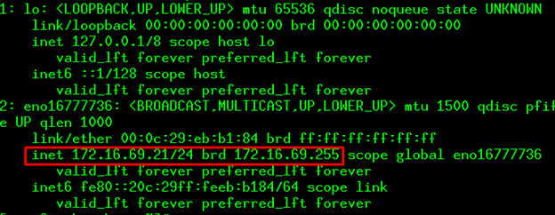

7. ***Kiểm tra kết nối mạng***

**[root@mail:~] # ping google.com**

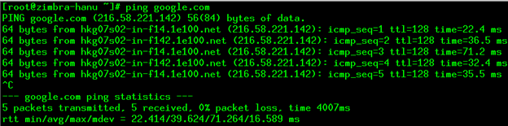

8. ***Cài đặt một số công cụ hỗ trợ***

**[root@mail~] # rpm -Uvh [http://dl.fedoraproject.org/pub/epel/epel-release-latest-7.noarch.rpm**](http://dl.fedoraproject.org/pub/epel/epel-release-latest-7.noarch.rpm)**

**[root@mail~] # rpm -Uvh http://rpms.famillecollet.com/enterprise/remi-release-5.rpm**

**[root@mail~] #yum install wget screen lsof rsync nmap net-tools unzip sudo sysstat perl-core -y**

**[root@mail /]# yum install vim-enhanced telnetyum -y**

9. ***Update hệ điều hành - optional***

**[root@mail~] #yum update -y**

10. ***reboot***

**[root@mail:~] #c**

4. **Chuẩn bị cài đặt Zimbra**

`	`***4.1.	Cài đặt webmin và DNS:***

***[root@mail /]# vim /etc/yum.repos.d/webmin.repo***

***[Webmin]***

***name=Webmin Distribution Neutral***

***#baseurl=http://download.webmin.com/download/yum***

***mirrorlist=http://download.webmin.com/download/yum/mirrorlist***

***enabled=1***

***[root@mail /]# rpm --import http://www.webmin.com/jcameron-key.asc***

***[root@mail /]# yum install webmin perl-Net-SSLeay -y***

***[root@mail /]# service webmin start***

***[root@mail /]# lsof -i :10000***

***[root@mail /]# chkconfig webmin on***

**[root@mail~] # yum install bind bind-utils bind-chroot –y**

**truy cập địa chỉ: [https://ip_máy:10000**](https://ip_máy:10000)**

**khởi tạo create master zone và các bản ghi:**

**hanu.vn A ip\_máy** 

**zimbra.hanu.vn A ip\_máy**

**hanu.vn MX zimbra.hanu.vn**

**Truy cập trình duyệt web (eg: coccoc)**

**-Go https://9.9.9.9:100000**

**-Login vào hệ thống**

**>username: root**

**>password: 123456a@**

**-Ở sidebar: vào “un-used modules”**

`		  `**Chọn> “BIND DNS server”**

**-Trong phần “Existing DNS Zones”: chọn> “create master zone”**

`				`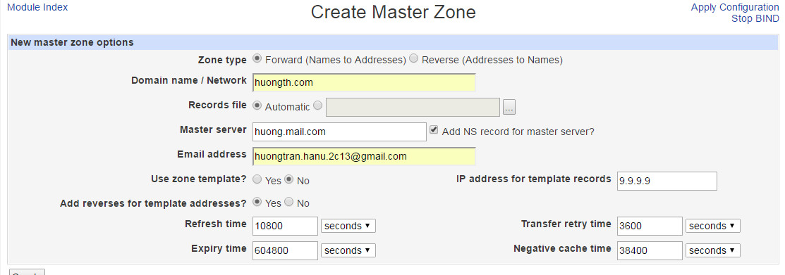

**-Trong Edit master zone**

`	`**>Chon Address: add 2 Address**

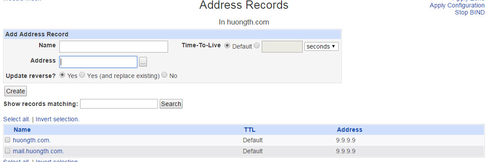

`	`**>Mail server: add mail server**

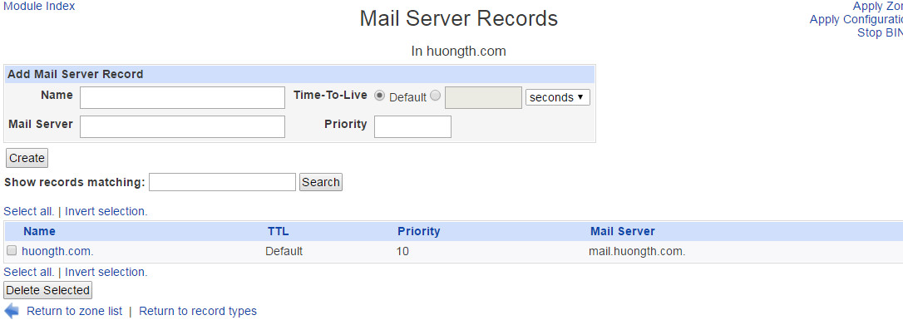

**6.Sửa file:**

`	`***4.2.	Sửa file named.conf***

**[root@mail:~] # vi /etc/named.conf**

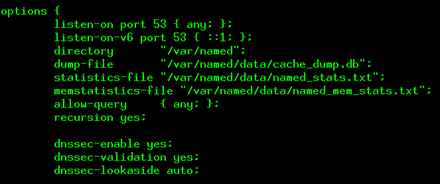

***listen-on port 53 { any; }***

***allow-query        {localhost; dải\_ip\_máy/24; }***

`	`***4.4.	Start và enable dịch vụ***

**[root@mail:~] #systemctl enable named**

**[root@mail:~] #systemctl start named**

`	`***4.5	Tạo rule cho firewall cho phép sử dụng DNS - optional***

***Tắt hẵn firewall:***

**[root@mail:~] #systemctl stop firewalld**

**[root@mail:~] #systemctl disable firewalld**

***OR***

**[root@mail:~] #systemctl enable firewalld**

**[root@mail:~] #systemctl start firewalld**

**firewall-cmd --permanent --zone=public --add-port=443/tcp** 

**firewall-cmd --permanent --zone=public --add-port=3930/tcp**

**firewall-cmd --permanent --zone=public --add-port=110/tcp**

**firewall-cmd --permanent --zone=public --add-port=25/tcp** 

**firewall-cmd --permanent --zone=public --add-port=143/tcp**         

**firewall-cmd --permanent --zone=public --add-port=993/tcp** 	

**firewall-cmd --permanent --zone=public --add-port=389/tcp** 	

**firewall-cmd --permanent --zone=public --add-port=995/tcp** 

**firewall-cmd --permanent --zone=public --add-port=7025/tcp**

**firewall-cmd --permanent --zone=public --add-port=5800/tcp**

**firewall-cmd --permanent --zone=public --add-port=5900/tcp**

**firewall-cmd --permanent --zone=public --add-port=7071/tcp** 	

**firewall-cmd --permanent --zone=public --add-port=3894/tcp**

**firewall-cmd --permanent --zone=public --add-port=3895/tcp**

**firewall-cmd --permanent --zone=public --add-port=80/tcp** 

**firewall-cmd --reload**

***Reload lại rule firewall***

**[root@mail ~] # firewall-cmd --list-all**

***Xem lai cac rule vua dat***

\*	**[root@mail:~] # vi /etc/resolv.conf**

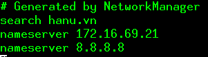

**[root@mail~] #vi /etc/hosts**

**Đoạn này ghi hostname của máy vào.** 

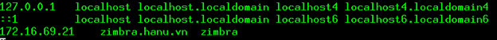

`	`***4.7.	Kiểm tra phân giải tên miền***

***Đoạn mx hỏi hanu.vn do cài đặt trên mail server tên là hanu.vn***

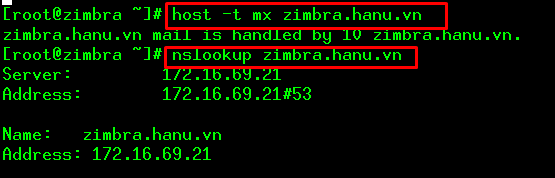

`	`***4.8. disable service***
\*
`	`**[root@mail ~] # systemctl stop postfix**

**[root@mail ~] # systemctl disable postfix**

***		

5. **Cấu hình và cài đặt Mail Zimbra**

***5.1	Download Zimbra CS NE 8 (8.6) về máy client***

**[root@mail~] #cd /**

**[root@mail/] #wget[` `*https://files.zimbra.com/downloads/8.6.0_GA/zcs-8.6.0_GA_1153.RHEL7_64.20141215151110.tgz***](https://files.zimbra.com/downloads/8.6.0_GA/zcs-8.6.0_GA_1153.RHEL7_64.20141215151110.tgz)**

***Ta tiến hành giải nén Zimbra đã tải về trong thư mục setupzimbra***

**[root@mail ~] # cd /**

**[root@mail /] #tar -vxzf zcs-8.6.0\_GA\_1153.RHEL7\_64.20141215151110.tgz**

***5.2 	Cài đặt zimbra***

**[root@mail/] #cd /zcs-8.6.0\_GA\_1153.RHEL7\_64.20141215151110**

**[root@mail tar xzf zcs-8.6.0\_GA\_1153.RHEL7\_64.20141215151110]#./install.sh --platform-override**

***Do you agree the the term of the software license agreement ?***

***=> Ta chọn Y***

***Tiếp tục là yêu cầu lựa chọn các gói để cài đặt. Ta cấu hình như sau :***

***gói zimbra-dnscache chọn N***

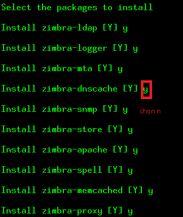

***Tiếp tục , ta chọn 6 để vào zimbra-store:***

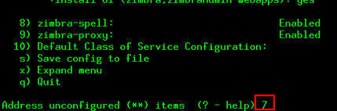

***Chọn 4 để cài đặt password : 123456a@***

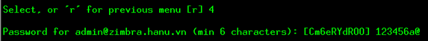

***Làm theo các bước trong hình***

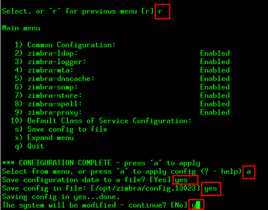

***change domain name: N***

***5.3	Kiểm tra trạng thái của service của Mail Zimbra***

***[root@mail~] #su - zimbra***

***[zimbra@mail ~]$ zmcontrol status***

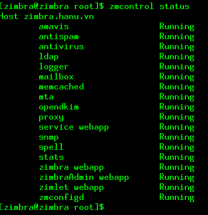

***truy cập https:// ip\_máy:7071 - giao diện quản trị zimbra server của admin***

***truy cập https://ip\_máy - giao diện webmail của người dùng. sau khi cài đặt xong, test gửi- nhận mail, nếu gửi nhận thành công là đạt.***

